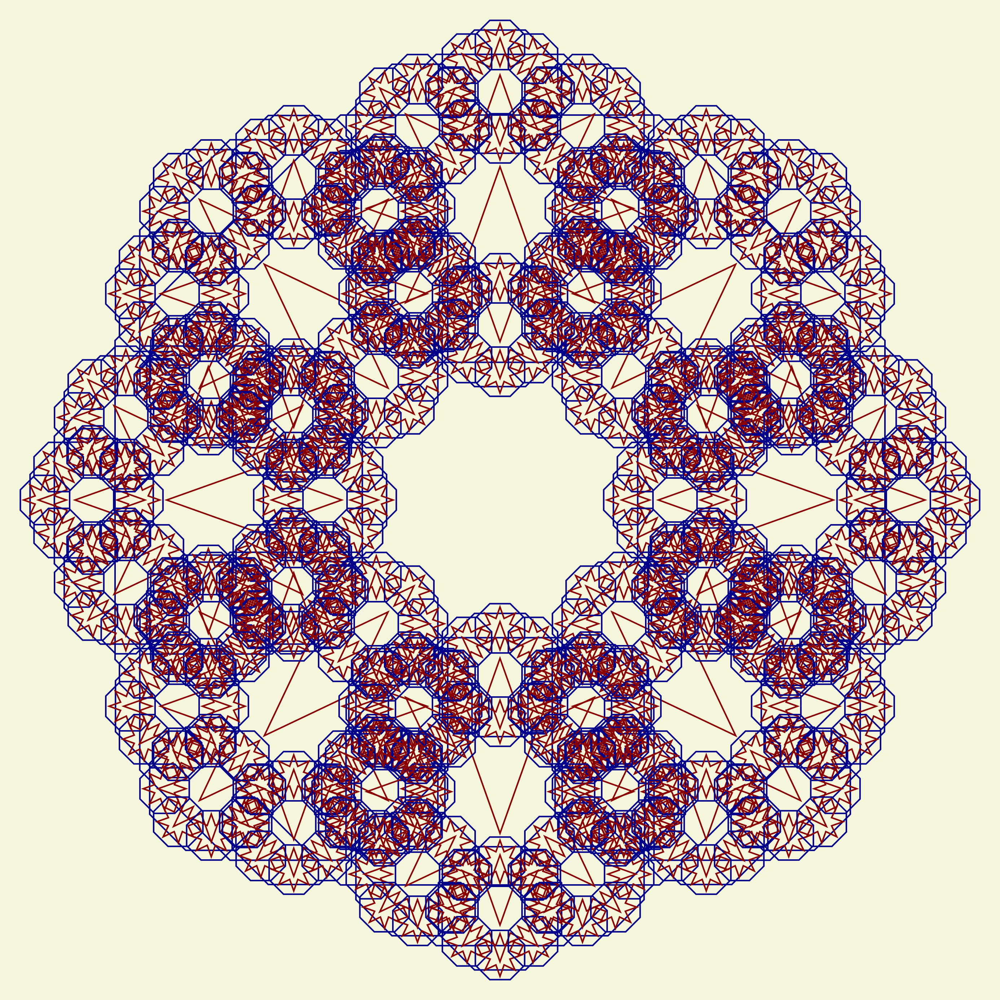

# Islamic Geometric Fractals Generator

Generate beautiful Islamic-style geometric patterns using recursive fractal techniques. This project creates intricate geometric designs inspired by traditional Islamic art, with configurable recursion depths and styling options.



## Features

- Generate complex Islamic geometric patterns using fractal mathematics
- Adjustable recursion depth (3-5 levels recommended)
- High-resolution output (300 DPI)
- Customizable colors and styling
- Based on traditional octagonal and star patterns
- Export to PNG format

## Installation

1. Clone the repository:
```bash
git clone https://github.com/yourusername/islamic-fractals.git
cd islamic-fractals
```

2. Create and activate a virtual environment (optional but recommended):
```bash
python -m venv venv
source venv/bin/activate  # On Windows, use: venv\Scripts\activate
```

3. Install the package in development mode:
```bash
pip install -e .
```

## Usage

### Generating Example Patterns

To generate patterns with different recursion depths (3, 4, and 5):
```bash
python examples/generate_examples.py
```

This will create three PNG files in the `output` directory:
- `islamic_fractal_depth_3.png`: Basic pattern (~64 elements)
- `islamic_fractal_depth_4.png`: Intermediate complexity (~512 elements)
- `islamic_fractal_depth_5.png`: High complexity (~4096 elements)

### Using in Your Own Code

```python
from islamic_fractals import IslamicFractalGenerator, save_figure

# Create a generator instance
generator = IslamicFractalGenerator(background_color='#f5f5dc')

# Generate a fractal with depth 4
fig, ax = generator.generate_fractal(depth=4)

# Save the figure
save_figure(fig, 'my_pattern.png')
```

### Customization Options

You can customize various aspects of the pattern:

```python
generator = IslamicFractalGenerator(
    background_color='#ffffff'  # Change background color
)

fig, ax = generator.generate_fractal(
    depth=4,      # Recursion depth
    size=5,       # Overall size
    dpi=300       # Output resolution
)
```

## Pattern Complexity Guide

### Depth 3
- Clearest individual patterns
- Approximately 64 smallest elements
- Fast rendering
- Best for web display or smaller prints
- Good for learning/understanding the structure

### Depth 4
- Balanced detail and overall structure
- Approximately 512 smallest elements
- Moderate rendering time
- Suitable for medium-sized prints
- Shows fractal nature clearly

### Depth 5
- Highest level of detail
- Approximately 4096 smallest elements
- Longer rendering time
- Best for large prints
- Most similar to traditional Islamic patterns
- May require more computational resources

## Project Structure

```
islamic_fractals/
├── islamic_fractals/          # Main package directory
│   ├── __init__.py           # Package initialization
│   ├── fractal_generator.py  # Core fractal generation code
│   └── utils.py             # Utility functions
├── examples/                 # Example scripts
│   └── generate_examples.py
├── output/                  # Output directory for generated images
├── setup.py                # Package setup file
├── requirements.txt        # Project dependencies
└── README.md              # This file
```

## Technical Details

The pattern generation uses these geometric principles:
1. Octagonal base structures
2. 8-pointed stars
3. Recursive subdivision
4. Proportional scaling
5. Radial symmetry

The implementation uses:
- NumPy for geometric calculations
- Matplotlib for rendering
- Object-oriented design for extensibility

## Dependencies

- Python ≥ 3.7
- NumPy ≥ 1.21.0
- Matplotlib ≥ 3.4.0

## Contributing

Contributions are welcome! Please feel free to submit a Pull Request.

## License

This project is licensed under the MIT License - see the LICENSE file for details.

## Acknowledgments

This project is inspired by traditional Islamic geometric patterns and the mathematical principles behind their construction.

## Future Improvements

- Add more pattern types
- Implement color schemes based on historical Islamic art
- Add animation support
- Include more geometric primitives
- Add GUI for interactive pattern generation
- Support for SVG output

For questions or suggestions, please open an issue on the GitHub repository.
